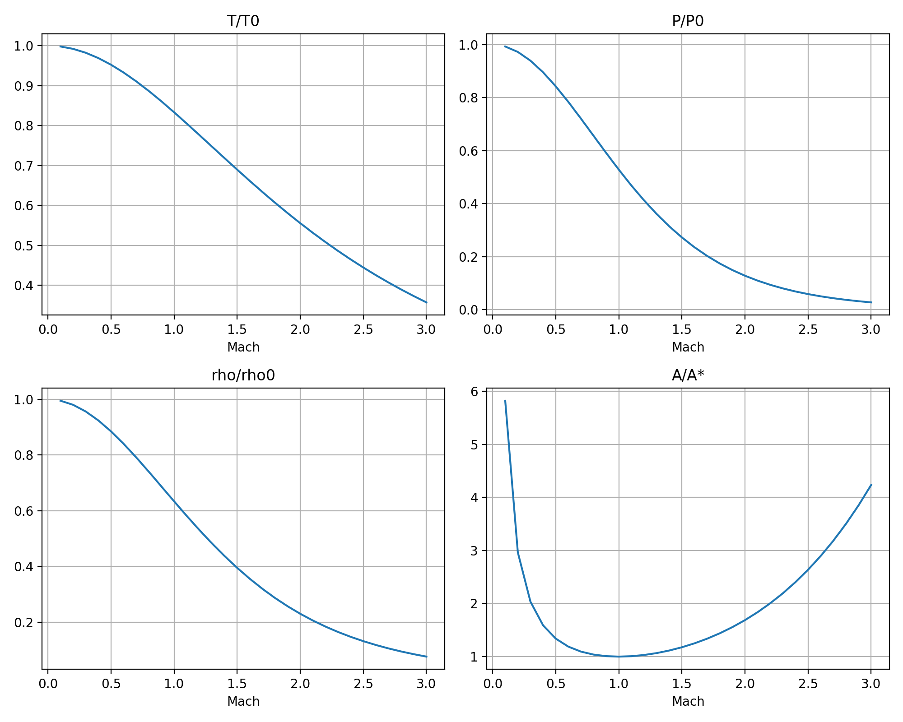
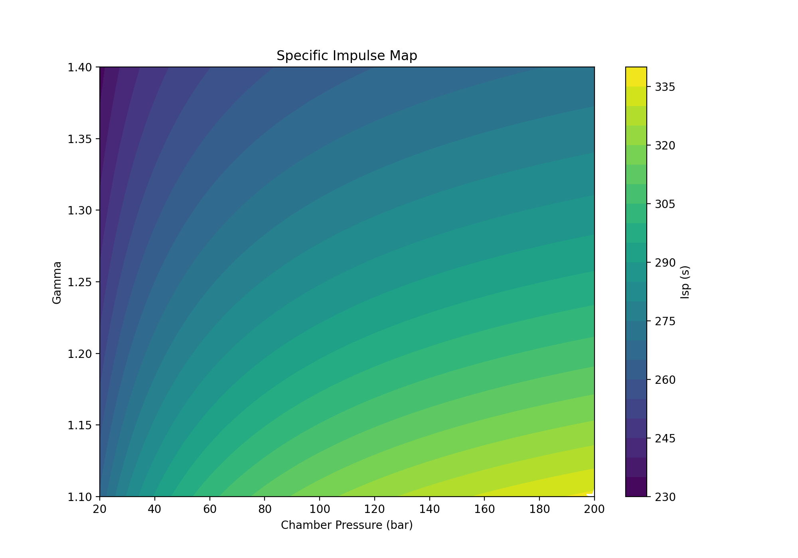
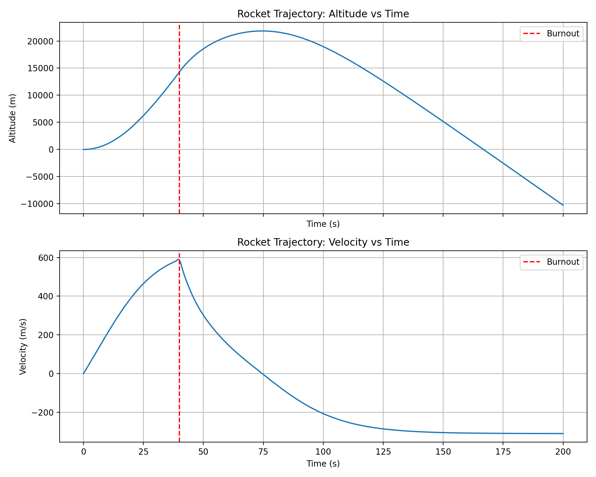

# Propulsion Tools

Computational tools for rocket and gas turbine propulsion analysis.
Built with Python, NumPy, SciPy, and Matplotlib.

## Repository Structure

### [`isentropic-flow/`](isentropic-flow/)
Isentropic flow property calculations and visualizations for compressible flow analysis.
- **Isentropic table generator** — computes T/T₀, P/P₀, ρ/ρ₀, A/A* for a range of Mach numbers
- **Inverse solver** — finds Mach number from area ratio using bisection method and SciPy's `fsolve`
- **Flow property plots** — line plots and 2×2 subplot visualizations

### [`nozzle-analysis/`](nozzle-analysis/)
Rocket nozzle performance analysis and parametric design studies.
- **Exhaust velocity calculator** — ideal nozzle exit velocity and specific impulse (Isp)
- **Nozzle flow classification** — identifies subsonic, choked, and supersonic conditions
- **Parametric study** — Isp variation with chamber pressure and specific heat ratio (γ)

### [`rocket-trajectory/`](rocket-trajectory/)
Sounding rocket trajectory simulation using coupled ODE integration.
- **Two-phase flight model** — powered ascent with mass depletion + unpowered coast
- **Aerodynamic drag** — velocity-dependent drag opposing motion
- **Trajectory analysis** — apogee, max velocity, burnout conditions

### [`engine-comparison/`](engine-comparison/)
Performance comparison of real rocket engines using thermodynamic analysis.
- **Raptor** (SpaceX) — CH₄/LOX, 300 bar chamber pressure
- **F-1** (Saturn V) — RP-1/LOX, 70 bar chamber pressure
- **RS-25** (Space Shuttle) — LH₂/LOX, 200 bar chamber pressure

## Tools Used

- **Python 3.12+** — core language
- **NumPy** — array operations and vectorized computation
- **SciPy** — equation solving (`fsolve`) and ODE integration (`solve_ivp`)
- **Matplotlib** — plotting and visualization

## Author

**Dhruva Vudhya**
MTech Aerospace Engineering | Propulsion & Combustion
